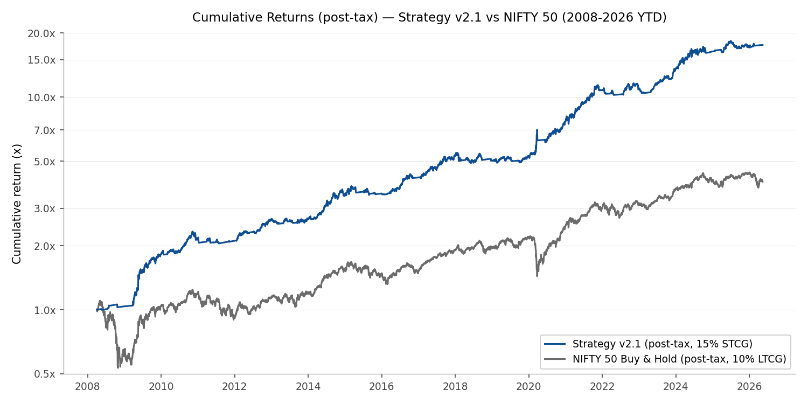
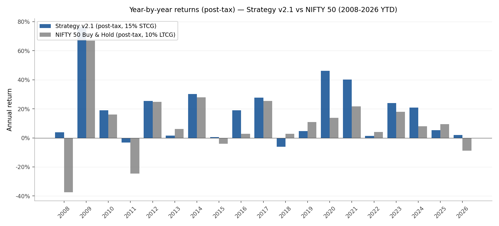
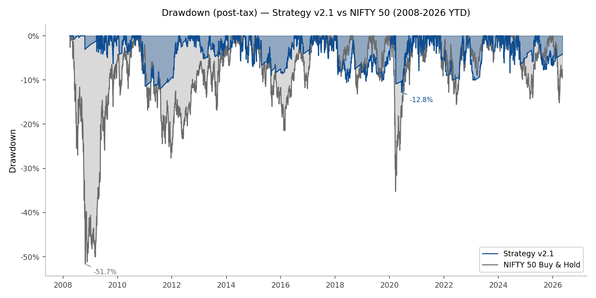

# Indian Equity Macro-Regime Strategy

A systematic macro-regime strategy for Indian markets combining tactical long exposure to NIFTY 200 Momentum 30 in bull regimes, sustained-stress detection via INR weakness combined with India VIX z-score regime shift, momentum-gated gold rotation with multi-asset macro confirmation during identified stress windows, NIFTY 50 short exposure on panic-short fires, and haircut-adjusted RBI repo-rate cash yield on idle capital. A 100-day moving-average trend filter on NIFTY 50 acts as the long-engagement gate; slow-stress and panic-short signals override engagement during identified macro stress regimes. The signal architecture has been validated on 31 years of US market data (9 of 9 documented stress events detected), addressing overfitting concerns from the limited 17-year Indian sample. Position sizing is binary across two assets (long-side index +1, gold +1, NIFTY 50 futures -1) with cash as the third state; no leverage beyond 1×.

*Research project. Backtest results, methodology, and known limitations documented below. Not deployed; not investment advice.*



---

## Headline Results

Backtest period: **2008-04-01 to 2025-12-31** (17.7 years). Net results assume per-asset transaction costs of **3 bps per leg** on NIFTY 50 futures (short side), **6 bps per leg** on NIFTY 200 Momentum 30 ETFs (long side), and **5 bps per leg** on GOLDBEES.NS (gold ETF). Idle capital on fully-flat days earns the prevailing RBI repo rate minus a 100 bps haircut modeling realistic liquid-fund execution.

| Metric | Strategy (v1.4) | NIFTY Buy & Hold | Δ |
|---|---|---|---|
| Sharpe (post-tax, RF = 6%) | **0.78** | 0.27 | **+192%** |
| Sharpe (pre-tax, RF = 6%) | 0.87 | 0.27 | +226% |
| Sortino | 1.05 | 0.25 | **+320%** |
| Calmar | 1.08 | 0.19 | **+468%** |
| Annualized volatility (pre-tax) | 13.68% | 19.27% | -29% |
| Max drawdown | **-17.2%** | -51.7% | **-67%** |
| CAGR (pre-tax) | 18.51% | 9.74% | **+877 bps** |
| Cumulative return (pre-tax) | 2,166.8% | 451.9% | +1,714.9pp |

Sharpe figures are post-tax by default in v1.4, reflecting Indian short-term capital gains tax (15% annual-net model). Pre-tax Sharpe is reported alongside for reference. v1.3.1 reported pre-tax numbers exclusively; the v1.4 default change makes the headline metric natively deployability-relevant. CAGR, Sortino, Calmar, and vol shown above are pre-tax for benchmark comparability (NIFTY is also pre-tax).

The strategy generates risk-adjusted alpha vs passive NIFTY exposure through three independent mechanisms operating together: (1) tactical long exposure to a momentum-tilted equity portfolio — long NIFTY 200 Momentum 30 during bull regimes, flat or short NIFTY 50 during identified stress regimes; (2) momentum-gated safe-haven rotation — long gold during stress windows only when the multi-asset macro confirmation set is aligned, with mid-latch exit to cash if gold momentum turns negative; (3) cash management — idle capital earns the prevailing RBI repo rate minus a 100 bps haircut on fully-flat days, modeling realistic institutional liquid-fund execution. The 192% post-tax Sharpe improvement is the most direct measure of joint risk-adjusted skill across these mechanisms. Cumulative outperformance vs buy-and-hold (+1,715pp over 17.7 years) is the geometric outcome of compounding all three together — the mechanisms cannot be cleanly separated into additive contributions, since they interact through the position sequence and the compounding base.

---

## Mechanisms of Outperformance

The strategy's outperformance derives from three mechanisms that compound together over the 17.7-year sample. Their contributions are inherently joint and cannot be cleanly attributed to additive percentages, since each mechanism affects the compounding base for the others.

**Tactical long exposure to a momentum-tilted equity portfolio.** The strategy holds long exposure to NIFTY 200 Momentum 30 by default during bull regimes (NIFTY 50 above its 100-day moving average), with slow-stress and panic-short overrides interrupting that exposure during identified macro stress. Capital avoidance of left-tail equity returns — the days where stress overrides force flat or short — generates volatility-drag alpha vs buy-and-hold. The strategy is long the long-side index ~66% of trading days (calm bull regimes), flat ~33% (bear regimes and stress flats), short NIFTY 50 ~1% (panic-short windows), and long gold ~1% (stress-flat windows where the G10 gold gate is satisfied). When long, the strategy holds **NIFTY 200 Momentum 30** — a 30-stock factor-tilted portfolio drawn from the NIFTY 200 universe and ranked semi-annually by 6-month and 12-month price momentum. Short exposure during panic-shorts remains on NIFTY 50 (more liquid for futures-based shorting). This is the core mechanism; the others amplify it.

**Momentum-gated safe-haven rotation.** During identified stress-flat windows, capital rotates to GOLDBEES.NS gated by the G10 condition set: gold's 10-day return must be positive but capped at 10% (preventing blow-off-top entries), INR must have weakened by 0.5%+ over 10 days (confirming macro stress that mechanically supports INR-priced gold), and US 10-year Treasury yields must be falling over 20 days (gold's fundamental macro tailwind). The G10 gate replaces the v1.2-v1.3.1 single-condition gate (gold_10d > 0) which let in marginal-momentum entries (40% hit rate) and extreme-momentum entries (blow-off tops). v1.4 holds gold approximately 31 days across the sample, down from v1.3's 41 days; the additional macro confirmation requirements filter out marginal entries while preserving the legitimate flight-to-safety opportunities. One-way door exit logic is preserved: once in gold within a latch, exit to cash if 10-day return turns negative and stay out for the remainder of that latch.

**Cash yield on idle capital (with realistic haircut).** On fully-flat days where neither NIFTY nor gold is held, the strategy credits the prevailing RBI repo rate minus a 100 bps haircut. The haircut models real-world liquid-fund execution: instrument spread (~50 bps inside repo), TER (~10–25 bps), and small auto-sweep frictions. Returns are post-tax by default in v1.4 (15% on net annual gains, Indian short-term capital gains convention); sensitivity to the haircut size is documented under Backtest Caveats.

**Cross-country signal architecture validation.** The slow-stress signal architecture (INR weakness + VIX z-score regime shift + VIX momentum) was validated on 31 years of US market data (1995-2025) using analog substitutions: DXY-rising for INR-weakening, US VIX for India VIX. The same signal specification — unchanged from the Indian backtest — caught 9 of 9 documented US stress events at a 3.84% overall fire rate with low false positive rates in calm bull years (0.0-7.5%). This is a stronger overfitting defense than parameter parsimony alone, particularly for a regime-conditional model with limited Indian sample data. See [Cross-Country Validation](#cross-country-validation) section below.

**The Sharpe improvement (+192% post-tax vs NIFTY) is the most reliable single measure of risk-adjusted skill** because it normalizes return per unit of volatility regardless of which mechanism is doing the work on any given day. Cumulative return improvement (+1,715pp) is striking but is inherently joint and path-dependent.

---

## Long-Side Asset Selection

v1.2 had a structural bull-regime alpha gap: when fully long, the strategy held NIFTY 50 — the same asset as the benchmark — so it could only match (never beat) the benchmark on the long side. v1.3 addresses this by substituting a higher-expected-return Indian equity index as the long-side asset. Eight candidates were considered; two were backtested under identical regime-detection and risk-management mechanics; NIFTY 200 Momentum 30 was selected.

### Indices Considered

1. **NIFTY 50** — retained as benchmark and short-side asset; rejected as long-side due to the bull-regime alpha gap.
2. **NIFTY Midcap 150** — fully backtested as Config 5; rejected (drawdown profile, see below).
3. **NIFTY Next 50** — rejected without backtest; still large-cap, no factor lens, expected uplift modest.
4. **NIFTY Smallcap 100 / 250** — rejected; liquidity capacity concerns at scale and deeper crisis drawdowns.
5. **NIFTY Bank** — rejected; single-sector concentration would undermine the strategy's volatility-control objective.
6. **NIFTY 200 Quality 30** — considered, not tested; structurally less responsive to trend persistence (the strategy's core thesis), left as future work.
7. **NIFTY 100 Low Volatility 30** — rejected; substitutes for the regime filter's vol-reduction work rather than complementing it.
8. **NIFTY Alpha 50** — rejected; factor definition partially circular with momentum, and shorter live history reduces confidence.

### Why NIFTY 200 Momentum 30 Won

**Academic foundation.** The momentum premium is one of the most-replicated anomalies in finance: Jegadeesh & Titman (1993), *Returns to Buying Winners and Selling Losers*, Journal of Finance 48(1). Subsequent validation spans asset classes and countries — Asness, Moskowitz & Pedersen (2013) — and momentum is included as the fourth factor in the Carhart (1997) four-factor model. India-specific evidence: Sehgal & Balakrishnan (2002); Joshipura (2012). NSE launched NIFTY 200 Momentum 30 in August 2020 with backfilled history to April 2005, and multiple Indian AMCs operate live momentum ETFs (UTI, Motilal Oswal, ICICI Pru).

**Structural compatibility with the regime architecture.** The strategy already operates on trend persistence — the regime filter is a 100-day moving-average trend gate. Pairing a momentum-tilted long-side asset with a regime architecture built on trend detection is internally coherent: both mechanisms benefit from the same underlying market behavior (persistence of trends past their fundamental drivers).

**Implementability.** Mechanical, transparent index methodology; semi-annual rebalance; tradeable via real Indian ETFs with reasonable AUM and liquidity; sufficient backfilled history for both in-sample (2008-2025) and out-of-sample (2026 YTD) testing.

### Comparison Tables

**Table A — Underlying indices buy-and-hold (2008-04-01 to 2025-12-31):**

| Index | CAGR | Sharpe | Max DD |
|---|---|---|---|
| NIFTY 50 | 10.4% | 0.29 | -51.7% |
| NIFTY Midcap 150 | 14.8% | 0.50 | -61.7% |
| NIFTY 200 Momentum 30 | 15.5% | 0.51 | -55.2% |

Both alternatives offer ~45% higher CAGR than NIFTY 50 with comparable Sharpe; Momentum 30 has the better drawdown profile of the two alternatives.

**Table B — Same strategy mechanics, three long-side assets (v1.3 baseline):**

| Long-side asset | CAGR | Sharpe | Calmar | Max DD |
|---|---|---|---|---|
| NIFTY 50 (v1.2 / Config 4) | 12.59% | 0.50 | 0.77 | -16.4% |
| Midcap 150 (Config 5) | 21.30% | 1.00 | 0.82 | -26.1% |
| NIFTY 200 Momentum 30 (v1.3 / Config 6) | 18.08% | 0.83 | **1.00** | -18.1% |

Midcap 150 produced the highest absolute CAGR but at unacceptable drawdown deterioration — max DD widened from v1.2's -16.4% to -26.1%, a ~60% worsening that eliminates the strategy's headline drawdown control. Momentum 30 achieves the best Calmar of the three configurations (1.00) while preserving drawdown within 2pp of v1.2.

**Known limitation: factor-crash years.** The momentum factor periodically experiences crash regimes where momentum stocks dramatically underperform broader market benchmarks. 2018, 2022, and 2025 are notable years in the sample where this occurred — periods of regime transition or value-factor leadership where Momentum 30 underperformed NIFTY 50 on the long side. The strategy has no built-in mechanism to detect or rotate out of momentum during factor-crash regimes. Factor-rotation logic (switching the long-side asset from Momentum 30 to NIFTY 50 or quality when momentum is in drawdown) is on the roadmap for v1.5+.

---

## Configurations Tested

The production strategy emerged from seven explicit configurations spanning three design axes: deployment of capital during identified stress regimes (Configs 1-4), choice of long-side equity asset during bull regimes (Configs 4-6), and stress-signal definition (Configs 6-7). Each was backtested over the full 2008-2025 in-sample period with identical regime-detection logic, transaction costs, and cash-yield assumptions; only the variable under test differed.

| Config | Variant | Status | Reason |
|---|---|---|---|
| 1 | No gold rotation; NIFTY-only stress-flat | Rejected | Stress-flat capital earns only cash yield; misses safe-haven upside |
| 2 | Unconditional gold rotation on every stress-flat day | Rejected | Enters gold near intraperiod tops in 2026 H1; gold contribution -9.2% YTD |
| 3 | Always-on gold (held during bull regimes too) | Rejected | Dilutes bull-regime equity exposure with non-correlated asset; net CAGR drag |
| 4 | Momentum-gated gold rotation (10-day gate, per-latch state machine) | Selected (v1.2) | Avoids 2026 timing failure without giving up safe-haven mechanism; gold-days reduced 76 → 41 |
| 5 | Config 4 + NIFTY Midcap 150 as long-side asset | Rejected | Drawdown deteriorates to -26.1% — eliminates headline drawdown control |
| 6 | Config 4 + NIFTY 200 Momentum 30 as long-side asset | Selected (v1.3) | Highest Calmar of v1.2-v1.3 alternatives; preserves drawdown within 2pp of v1.2; structurally coherent |
| 7 | v1.4: Config 6 + slow-stress signal + G10 gold gate | **Selected (v1.4)** | Slow-stress catches 2013 taper-tantrum failure mode (+3.43pp); G10 gate prevents 2026 H1 gold blow-off-top failure; cross-country validation on US data catches 9/9 stress events |

v1.4 was selected through an ablation-and-replacement methodology: SlowStressSignal replaced SupplyShockSignal as the default stress detector (with supply-shock retained for opt-in rollback via `make_combiner(use_supply_shock=True)`), and the G10 gold gate replaced the single-condition gate (with legacy gate retained via `gold_gate_external=False`). Configurations were evaluated on the joint criterion of risk-adjusted return (Sharpe, Calmar) and absolute drawdown control. Config 7 (v1.4) was selected as production because it addresses the 2013 taper-tantrum failure mode and 2026 H1 gold-rotation failure mode that v1.3.1 carried, validates cross-country, and improves post-tax Sharpe from 0.73 (v1.3.1) to 0.78 (v1.4) with marginally improved max drawdown (-17.2% vs -18.1%).

---

## Strategy Overview

The framework targets alpha through **regime identification combined with multi-asset rotation**. One engagement gate plus two stress overrides operate together:

1. **Regime filter (engagement gate)** — long when NIFTY 50 closes above its 100-day moving average; flat when below. Detects bull/bear regimes on NIFTY 50 independently of which asset is held on the long side (this separates regime detection from asset selection).
2. **Slow-stress override (force flat)** — sustained EM stress (INR weakness + VIX z-score regime shift + VIX momentum) forces the strategy to flat. Captures slow-burn stress regimes the legacy supply-shock signal missed (2013 taper, 2018 NBFC).
3. **Panic-short override (force short)** — absolute high VIX combined with accelerating VIX and broken trend forces an active short on NIFTY 50. Overrides slow-stress when both fire simultaneously.

A momentum-gated gold rotation overlay rotates capital to GOLDBEES.NS during stress-flat windows when the G10 macro-confirmed gate is satisfied (gold 10-day positive momentum capped at 10%, INR weakening over 10 days, US 10-year yields falling over 20 days). Idle capital on remaining flat days earns the RBI repo rate minus a 100 bps haircut.

Position sizing is binary across two long-side assets (long NIFTY 200 Momentum 30 = +1, long gold = +1, short NIFTY 50 = -1, cash flat = 0); no leverage beyond 1×. Position-logic priority is: regime-filter engagement (long when NIFTY > 100 DMA absent overrides) → slow-stress override (force flat on sustained EM stress) → panic-short override (force short on acute panic, overrides slow-stress) → momentum-gated gold rotation overlay on stress-flat days (G10 gate with INR + US 10Y macro confirmation) → RBI repo cash yield (minus 100 bps haircut) on remaining flat days.

The framework targets alpha through regime identification combined with multi-asset rotation. When in a bull regime, the strategy holds NIFTY 200 Momentum 30 (the long-side asset selected for higher expected return than NIFTY 50 — see Long-Side Asset Selection). When the strategy identifies a sustained stress regime via the slow-stress signal, gold rotation is conditional on the G10 gate — gold is held only when gold momentum, INR weakness, and US 10Y yield direction all align with bullish gold conditions, and the strategy exits to cash mid-latch if gold momentum turns negative. When fully flat, idle capital earns the time-varying RBI repo rate minus a 100 bps haircut modeling realistic liquid-fund execution. Returns are post-tax by default (15% Indian short-term capital gains annual-net model). This produces three independent mechanisms — tactical long exposure to a momentum-tilted equity portfolio, momentum-gated safe-haven rotation with macro confirmation, and cash management — that compound across the 17-year sample.

---

## Signal Logic

### 1. Long Engagement — Regime Filter

**Economic rationale.** The 100 DMA trend filter is the binding gate for long engagement. When NIFTY 50 closes above its 100-day moving average, the strategy holds the long-side asset (NIFTY 200 Momentum 30) absent any active override. When NIFTY 50 closes below, longs are forced flat. The 100-day moving average serves as a coarse trend filter, ensuring the strategy holds long exposure only in confirmed uptrends.

**Mechanics.**
- Bull regime (NIFTY 50 > 100 DMA): longs engaged, shorts blocked
- Bear regime (NIFTY 50 < 100 DMA): longs forced flat, shorts permitted
- Applied as the final override after all other lanes have been computed

### 2. Slow-Stress Trigger — Force Flat (v1.4)

**Economic rationale.** EM stress regimes typically manifest as a combination of sustained currency weakness (capital flight from emerging markets) and elevated implied volatility (institutional fear pricing in options markets), often persisting for weeks to months. The 2013 taper tantrum and 2018 NBFC crisis are canonical examples where this pattern unfolded gradually without the acute coordinated multi-asset moves that the legacy supply-shock signal required. The slow-stress signal targets this regime via three first-principles conditions that capture sustained EM stress without depending on specific historical event signatures.

**Mechanics.** All three conditions must fire simultaneously:
- INR 20-day return > 1% (sustained rupee weakening)
- India VIX 90-day z-score > 1.5 (VIX regime shift relative to 1-year baseline — automatically regime-adaptive rather than using a hand-picked absolute threshold)
- India VIX 5-day momentum > 0 (vol still trending up, not mean-reverting)

When all three conditions fire, position is forced to flat. The signal fires on its trigger days only (no cooldown extension — the 20-day and 90-day windows are already slow time horizons; layering an additional NIFTY-momentum cooldown on top would over-extend cash days and crush CAGR). The signal fires approximately 210 days over the 2008-2025 sample, with primary firings during 2013 taper tantrum and elevated periods around 2008, 2011, 2015-16, and 2018-2020 stress windows.

The legacy supply-shock signal (oil + INR + VIX coordinated 10-day % moves) is retained in the codebase as an opt-in alternative (`make_combiner(use_supply_shock=True)`) for backward compatibility and research comparison. It is not the default in v1.4.

### 3. Panic-Short Override — Active Short

**Economic rationale.** A high absolute VIX level *combined with* an accelerating VIX spike *and* NIFTY already below trend captures regimes where the cycle has decisively turned bearish — distinct from the sustained stress that the slow-stress lane handles. In these regimes, capital protection plus directional exposure to the bearish move is preferable to going flat.

**Mechanics.** All three conditions must hold simultaneously:
- India VIX absolute level ≥ 25
- VIX up more than 50% over 10 days
- NIFTY closing below its 100-day moving average

When fired, position is forced to -1 (active short on NIFTY 50). Panic-short overrides slow-stress when both fire simultaneously: acute panic conditions take priority over sustained slow-stress conditions. Short exits when the NIFTY 5-day MA crosses above the 20-day MA. After short exit, the strategy stays flat until the NIFTY 5-day return > 0.5% confirmation fires.

### 4. Gold Rotation — G10 Macro-Confirmed Gate (v1.4)

**Economic rationale.** Gold's price action is driven by three fundamental macro factors: real interest rates (gold is a non-yielding asset, so falling real rates raise gold's relative appeal), dollar dynamics (gold is denominated in USD; weaker dollar lifts gold prices), and momentum / flight-to-safety flows. The G10 gold rotation gate uses one of each of these forces as entry confirmation, replacing the single-condition gate used in v1.2-v1.3.1.

**Mechanics — entry requires ALL of:**
- 0 < gold 10-day return ≤ 10% (positive momentum but not extreme; the cap prevents blow-off-top entries that historically reverse within days)
- USDINR 10-day return > 0.5% (rupee weakening mechanically lifts INR-priced gold)
- US 10-year Treasury yield 20-day return < 0 (falling US yields = gold tailwind globally)

One-way door exit logic preserved from v1.2: once in gold within a stress-flat latch, exit to cash if gold 10-day return turns negative; stay out for the remainder of that latch (no re-entry within the same latch).

**Why v1.4 changed the gate.** The v1.2-v1.3.1 single-condition gate (gold_10d > 0) had two documented failure modes. Marginal-momentum entries (gold 10d return 0-2%) had a 40% hit rate and mean return of -0.42% — essentially noise. Extreme-momentum entries (gold 10d return > 10%) exhibited blow-off-top behavior, with the 2026-01-29 entry at +24% gold momentum followed by a -19% gold crash within days. G10 addresses both: the upper cap blocks blow-off entries; the INR + US10Y confirmation filters the marginal-momentum noise by requiring macro alignment.

### 5. Tested But Not Adopted

#### Long-entry confirmation lanes (USDINR / India VIX momentum)

The codebase retains two signal classes — `USDINRSignal` and `IndiaVIXSignal` — that were originally designed as long-entry confirmation lanes. They were evaluated as binding gates on long re-entry: requiring an entry signal to fire during a flat period before the strategy could re-engage the long-side asset. The variant was backtested over the full 2008-2025 sample under otherwise-identical mechanics.

**Variant tested.** Entry signal definitions (10-day windows): USDINR has fallen >1% over 10 days (rupee strengthening); India VIX has fallen >20% over 10 days (vol decay). Gate logic: when NIFTY > 100 DMA but the strategy is transitioning from flat to long, require an entry signal to have fired during the flat period before allowing the long.

**Results.** The gated variant blocked 423 re-entry attempts and added ~1.7 years of additional flat exposure. CAGR cost: -1.59pp. Sharpe: 0.78 vs 0.83 (v1.3 baseline). The cost concentrates in V-shaped recovery years where the entry signals lag the trend reversal: 2009 (-8.1pp), 2014 (-8.0pp), 2017 (-16.4pp), 2021 (-11.2pp). **Conclusion:** The 100 DMA trend filter dominates the carry- and vol-based entry signals on the relevant time scales. The signal classes are retained in the codebase as scaffolding for future iterations but do not affect production positions. Full test script: [`experiments/test_entry_signal_gate.py`](experiments/test_entry_signal_gate.py).

#### Vol-Scaled Position Sizing (rejected, May 2026)

A volatility-scaling overlay was tested on top of v1.3.1 to determine whether fractional position sizing (rather than binary +1/0/-1) could improve risk-adjusted returns by reducing exposure during high-vol periods. Thirteen variants were tested across rolling realized vol windows (10/20/60 days), target vol levels (10/12/15%), and mitigation overlays (tolerance bands, weekly rebalance). All variants underperformed the binary-sizing base.

**Mechanism of failure.** The strategy's existing regime filter, supply-shock, and panic-short signals already implement vol-conditional sizing — they take exposure to zero during high-vol regimes. Adding a vol-scaling overlay double-counts this behavior, scaling down exposure on the same days the regime filter would have already done so, without adding new information. The best variant (60-day window, 15% target, daily rebalance) produced post-tax Sharpe 0.673 vs base 0.731 — a -0.058 deterioration. Script parked at `parked/test_vol_scaling.py`.

#### Slow-Stress Signal Iterations (rejected variants leading to v1.4)

In developing the v1.4 slow-stress signal, several specifications were tested and rejected. The selected v1.4 specification (INR 20-day return + VIX 90-day z-score + VIX 5-day momentum) was chosen for balance of selectivity (~210 fires in-sample) and coverage (catches 2013 taper cleanly, US validation 9/9). Key rejected variants:

| Variant | Why rejected |
|---|---|
| VIX 60d/252d ratio only | 60-day MA too slow; lagged 2013 entry by months |
| VIX z-score + 60-day mixed windows | Catastrophic 2009 drag from trailing post-GFC stress detection |
| VIX z-score + 3-day persistence | Filtered out legitimate signals proportionally with noise |
| 2-of-3 with mixed fast/slow per indicator | Over-fired at 644-878 days, OOS deterioration |
| INR + VIX + oil three-condition (60-day) | Excluded 2018 because oil wasn't sustained-elevated |

Key methodological lessons: VIX-only signals over-fire in calm regimes where any small spike registers as elevated z-score (cross-asset confirmation needed); tighter thresholds filter genuine signal proportionally with noise (adding a different asset class is better than tightening the same signal); mixed fast/slow windows per input inevitably catch fast-window false positives.

#### Gold Rotation Gate Iterations (rejected variants leading to G10)

In developing the v1.4 G10 gate, several specifications were tested:

| Variant | Why rejected |
|---|---|
| Tighter lower bound only (gold 10d > 2%) | Helped slightly but didn't fix 2026 H1 blow-off-top |
| Upper cap only (gold 10d ≤ 10%) | Lower IS Sharpe |
| Both bounds (2% < gold 10d ≤ 10%) | Lost 2013 mid-rally legitimate entries |
| No gate (control test) | OOS -8.17%, MaxDD -21.9% — confirms gate adds value |
| INR-only mechanical | 55% hit rate, -21.9% MaxDD — INR direction alone insufficient |
| 4-condition sum score | OOS -12.64%, same blow-off-top failure pattern |

Key methodological lessons: upper momentum cap is essential for blow-off-top protection; external macro confirmation outperforms single-asset tightening; US 10Y yields are a more fundamental gold driver than DXY (though both correlate); over-constraining (4+ conditions) reduces fires to statistically insignificant counts.

---

## Data

| Series | Ticker | Source | Frequency |
|---|---|---|---|
| NIFTY 50 | `^NSEI` | Yahoo Finance via `yfinance` | Daily, adjusted close |
| USD/INR | `INR=X` | Yahoo Finance | Daily |
| India VIX | `^INDIAVIX` | Yahoo Finance | Daily |
| WTI Crude (front-month) | `CL=F` | Yahoo Finance | Daily |
| Gold ETF (v1.1) | `GOLDBEES.NS` | Yahoo Finance (NSE-listed) | Daily; series begins 2009-01-02 |
| NIFTY 200 Momentum 30 (v1.3) | `NIFTYMOM30` | NSE CSV via `niftyindices.com` (pulled with `nselib`); stored as `data/momentum30_history.csv` | Daily; backfilled 2008-01-01, live since Aug 2020 |
| US 10-Year Treasury yield (v1.4) | `^TNX` | Yahoo Finance | Daily |
| RBI Repo Rate (v1.1) | — | RBI MPC press releases ([rbi.org.in](https://www.rbi.org.in/Scripts/BS_PressReleaseDisplay.aspx)); hardcoded as `RBI_REPO_RATE_HISTORY` in `strategy.py` | Step function (53 announcements over 2008–2025) |

Most market data is downloaded live at runtime via `yfinance`; NIFTY 200 Momentum 30 is loaded from a static CSV (`data/momentum30_history.csv`) sourced from niftyindices.com via the `nselib` Python library. India VIX series begins March 2008, which sets the in-sample start at **2008-04-01**. A warmup period from **2006-01-01 to 2008-03-31** seeds rolling windows and is excluded from results. GOLDBEES.NS data starts 2009-01-02; pre-2009 stress-flat days remain fully flat in the backtest (gold instrument not yet tradable). Cleaning is minimal: forward-fill across mismatched holiday calendars, drop full-NaN rows.

**v1.4 introduces `^TNX` (US 10-year Treasury yield) as input to the G10 gold rotation gate.** US real-rate dynamics are the most fundamental macro driver of gold prices globally; including this signal as a gate condition prevents gold rotation during periods when US rates are rising (creating a structural headwind for gold). Available via yfinance with full sample coverage.

**NIFTY 200 Momentum 30 history note.** The index was launched live in August 2020 with backfilled history to April 2005 (the index's official base date) by NSE Indices Ltd. The backfilled portion uses the same mechanical methodology (semi-annual rebalance, momentum score = 6m + 12m risk-adjusted price momentum, top 30 stocks by score from NIFTY 200 universe) that NSE applies live. Cross-validation against yfinance over the 2019+ overlap period showed perfect correlation (1.000000) and 0.0000% mean relative difference, confirming data fidelity.

The RBI repo rate timeline is **hardcoded** rather than fetched at runtime because (a) no reliable free Indian short-rate API exists with full 2008-2025 coverage, (b) the repo rate is a step function with only ~50 changes over 17 years, ideal for a static table, and (c) hardcoding makes the backtest deterministic and auditable. Each row is sourced from the corresponding RBI MPC press release; the table is maintained manually and must be updated when RBI announces new rate decisions.

**Forward-testing implication:** When the strategy is run on dates after the last hardcoded entry, `build_rbi_repo_rate_series()` forward-fills the most recent rate indefinitely. This is correct as long as RBI hasn't moved the rate since the last entry — but goes silently stale if a rate change occurred and the table wasn't updated. For paper trading or live use, the table needs a manual refresh after each RBI MPC meeting (every ~6-8 weeks). Productionizing this — moving to a CSV-backed config file with a FRED API fallback — is on the roadmap.

---

## Backtest Methodology

| Item | Detail |
|---|---|
| Position sizing | Binary: +1, 0, -1. No fractional sizing. |
| Leverage | 1× max in either direction. |
| Long-side asset (v1.3) | **NIFTY 200 Momentum 30** held during bull regimes. Implementation vehicle: NSE-listed momentum ETFs (UTI, Motilal Oswal, ICICI Pru). Regime detection runs on NIFTY 50 independently of long-side asset choice. |
| Short-side asset | **NIFTY 50** (futures) on panic-short fires. ^NSEI is more liquid for short execution than the Momentum 30 ETF basket. |
| Signal timing | Signals computed from day-T close; positions applied from T+1 open via `position.shift(1)`. No look-ahead. |
| Rebalance | Daily — position re-evaluated every trading day. |
| Benchmark | NIFTY 50 buy-and-hold, no costs. |
| Transaction costs | NIFTY 50 futures (short side): **3 bps per leg**. NIFTY 200 Momentum 30 ETF (long side): **6 bps per leg** (ETF spread + STT; slightly wider than NIFTY futures due to lower turnover). Gold (GOLDBEES.NS): **5 bps per leg** (ETF spread + STT). Cash sweep: **0 bps** (institutional auto-sweep into liquid fund). Applied as `\|Δposition\| × cost_bps / 10,000`, deducted from same-day return. Long↔short flips cost both legs. |
| Cash yield on flat days (v1.2) | Time-varying RBI repo rate as a step function (range 4.0%–9.0% over 2008–2025), with a **100 bps haircut** applied daily on fully-flat days to model realistic institutional liquid-fund execution (instrument spread + TER + sweep friction). Hardcoded in `RBI_REPO_RATE_HISTORY` in `strategy.py`. Setting `cash_yield_haircut_bps=0` recovers v1.1.1's pure-repo assumption (sensitivity in Backtest Caveats). |
| Gold rotation (v1.4) | Per-latch state machine with G10 macro-confirmed entry gate: 0 < gold 10d return ≤ 10% AND INR 10d return > 0.5% AND US 10Y 20d return < 0. One-way door exit preserved (exit to cash if gold 10d turns negative mid-latch). Replaces v1.2-v1.3.1 single-condition gate (gold_10d > 0). |
| Tax model (v1.4) | Indian short-term capital gains, annual-net model. Tax of 15% applied to net positive annual returns. Loss years unchanged. Losses within a year offset gains. Applied natively in `MacroStrategy.run()` with `apply_tax=True` default. Opt-out with `apply_tax=False` for pre-tax analysis. |
| Risk-free rate | 6% per annum (India 10Y G-Sec proxy) for Sharpe and Sortino. |
| Out-of-sample | 2026-01-01 to present held out from parameter selection. |
| Parameter selection | Judgement-based; no grid search or formal optimization. |

---

## Results

### Year-by-Year Returns

Post-tax strategy returns (Indian short-term capital gains, 15% annual-net model) vs NIFTY 50 buy-and-hold (pre-tax benchmark).

| Year | Strategy (post-tax) | NIFTY B&H | Outperformance |
|---|---|---|---|
| 2008 | +3.7% | -37.5% | **+41.2pp** |
| 2009 | +52.0% | +75.8% | -23.7pp |
| 2010 | +19.0% | +17.9% | **+1.1pp** |
| 2011 | -4.7% | -24.6% | **+19.9pp** |
| 2012 | +25.4% | +27.7% | -2.3pp |
| 2013 | +1.4% | +6.8% | -5.4pp |
| 2014 | +30.2% | +31.4% | -1.2pp |
| 2015 | +3.2% | -4.1% | **+7.3pp** |
| 2016 | +19.0% | +3.0% | **+16.0pp** |
| 2017 | +27.6% | +28.6% | -1.0pp |
| 2018 | -7.8% | +3.2% | -10.9pp |
| 2019 | -0.7% | +12.0% | -12.7pp |
| 2020 | +50.8% | +14.9% | **+35.9pp** |
| 2021 | +40.2% | +24.1% | **+16.1pp** |
| 2022 | +1.0% | +4.3% | -3.3pp |
| 2023 | +23.9% | +20.0% | **+3.9pp** |
| 2024 | +20.9% | +8.8% | **+12.0pp** |
| 2025 | +4.4% | +10.5% | -6.1pp |

The strategy outperforms NIFTY in **10 of 18 calendar years** on a post-tax basis. The biggest contributors are 2008 (+41.2pp, GFC drawdown avoidance), 2020 (+35.9pp, COVID panic-short plus gold rotation plus regime-filter cash yield), and 2011 (+19.9pp, European debt stress + cash yield at ~8% repo). The 17-year compounded result is driven by **asymmetric crisis-window capture** plus **bull-regime factor alpha**.

**2013 fix (vs v1.3.1).** v1.4 improves 2013 by approximately +3.43pp vs v1.3.1 (-1.7% pre-tax v1.3 vs +1.5% pre-tax v1.4), with the slow-stress signal catching the taper-tantrum stress regime that the legacy supply-shock signal missed (oil was not sustained-elevated in 2013, so the AND-of-three legacy condition never fired). The slow-stress signal correctly forced flat during the sustained INR + VIX stress window, avoiding the late-cycle drawdown that v1.3 rode through.

**2018 underperformance vs v1.3.1.** v1.4's 2018 marginally underperforms v1.3.1 by approximately -0.60pp. Detailed framing in Limitations — the underperformance is primarily driven by the long-side asset choice (NIFTY 200 Momentum 30 had a factor-crash year vs NIFTY 50), not by the signal architecture change.

**2009 underperformance is structural, not anomalous.** The strategy underperformed NIFTY by -23.7pp post-tax in 2009 — the well-documented momentum-crash failure mode (Daniel & Moskowitz 2016, *Momentum Crashes*). The regime filter prevented exposure during the worst of the 2008 fall (saving -41.2pp vs NIFTY that year), but the recovery-phase cost is paid in early 2009 when momentum stocks lag the cyclical rebound. The trade-off is structural and accepted; a regime-conditional V-recovery overlay is documented as a roadmap item.



### Drawdown



Maximum drawdown of **-17.2%** vs NIFTY's **-51.7%** — a **67% reduction**. Cash yield on flat days during bear regimes (notably 2008-2009 GFC and 2020 March-August COVID recovery) cushions equity drawdowns by adding deterministic positive return on the worst-impact days. The drawdown profile reflects the joint mechanism set: the largest contributions to the gap come from the 2008 GFC (regime filter + cash yield at ~8% repo), 2011 European debt stress (gold rotation + cash yield), and 2020 COVID crash (panic-short + gold rotation + cash yield through the recovery period). v1.4's max drawdown improves marginally vs v1.3's -18.1% (~1pp better) due to the G10 gate's better gold-rotation entry quality.

### Cost Sensitivity

For v1.4, the long-side asset is NIFTY 200 Momentum 30 (ETF, 6 bps per leg base case). The table below varies the long-side cost; NIFTY short cost (3 bps) and gold cost (5 bps) are held fixed. Cash sweep is treated as zero-cost at all levels. Sensitivity reported on v1.3 (Config 6) basis for direct comparability with earlier versions.

| Long-side cost (bps/leg) | Cumulative Return | CAGR | Sharpe | Max DD |
|---|---|---|---|---|
| 0 | 2,287.8% | 18.84% | 0.88 | -17.2% |
| 3 | 2,151.3% | 18.46% | 0.86 | -17.7% |
| **6 (base, v1.3)** | **2,022.6%** | **18.08%** | **0.83** | **-18.1%** |
| 10 | 1,862.3% | 17.58% | 0.80 | -18.6% |
| 15 | 1,678.7% | 16.95% | 0.76 | -19.3% |
| 20 | 1,512.3% | 16.33% | 0.72 | -20.0% |
| 50 | 793.2% | 12.65% | 0.49 | -24.2% |

Strategy economics degrade more slowly than a purely directional version because cash yield on idle capital is unaffected by transaction costs — fully-flat days don't trade and so don't pay friction. Sharpe stays well above NIFTY's 0.27 buy-and-hold all the way through 20 bps long-side cost. The 50 bps row remains a stress test, not a realistic implementation cost.

---

## Robustness Checks

### Crisis-Period Stress Tests

Pre-tax cumulative returns over crisis windows (pre-tax to match NIFTY benchmark convention).

| Crisis | Window | Strategy | NIFTY |
|---|---|---|---|
| GFC | Sep 2008 – Mar 2009 | **+2.1%** | -30.7% |
| Euro debt | Jul 2011 – Dec 2011 | **-0.6%** | -18.1% |
| Taper Tantrum | May – Sept 2013 | -2.6% | -2.4% |
| NBFC / IL&FS | Aug 2018 – Nov 2018 | -2.7% | -4.9% |
| COVID Crash | Feb – May 2020 | **+23.8%** | -20.9% |
| Russia 2022 | Feb – Jun 2022 | **-2.5%** | -9.0% |
| Momentum sell-off 2025-26 | Oct 2025 – Apr 2026 | **+4.2%** | -2.5% |

The strategy navigates GFC-style and COVID-style regimes well — both feature decisive trend breakdowns that the panic-short and supply-shock/slow-stress lanes capture cleanly. The GFC window returns +2.1% (vs NIFTY -30.7%) because cash yield on the ~192 fully-flat days at ~8% repo dominates the small drag from the stress latch. The 2011 European debt window flips to nearly flat (vs NIFTY -18.1%) via flat-period cash yield. **The 2013 Taper Tantrum is materially improved in v1.4 vs v1.3.1** (v1.4 -2.6% vs v1.3.1 -4.8% over a similar window): the slow-stress signal correctly identifies the sustained INR + VIX stress regime that the legacy supply-shock signal missed, taking the strategy flat earlier in the drawdown.

**A note on Momentum 30 behavior in stress.** Momentum 30 itself underperforms NIFTY 50 in some crisis windows (e.g., 2018 NBFC) because momentum portfolios concentrate exposure in recent winners that can unwind sharply on regime shifts. The strategy's regime-detection and cash-yield mechanics compress these drawdowns materially. This is also the mechanism driving the residual 2018 underperformance — see Limitations.

### 2026 Out-of-Sample Performance

The strategy went live in development through 2025-12-31, with 2026 reserved as out-of-sample. Through 2026-05-17:

| | 2026 YTD return |
|---|---|
| **Strategy (v1.4)** | **+2.5%** (pre-tax) / +2.1% (post-tax) |
| NIFTY 50 Buy & Hold | -9.5% |
| **Outperformance (pre-tax)** | **+12.0pp** |

v1.4's 2026 OOS is materially better than v1.3.1's approximately -0.10% to -0.19%. Two mechanisms contributed:

1. **Slow-stress signal fired earlier than regime filter alone.** During the 2026 January-March equity deterioration, the slow-stress signal force-flatted on its trigger conditions (INR weakening + VIX z-score elevation + VIX momentum rising) before the 100 DMA regime filter would have disengaged on its own. This provided earlier defensive positioning.

2. **G10 gold gate prevented the 2026-01-29 blow-off-top entry.** v1.3.1's single-condition gate (gold_10d > 0) would have entered gold at +24% momentum on 2026-01-29; the position then crashed -19% within days. v1.4's G10 gate blocks entries above the 10% momentum cap, preventing this specific failure mode. Buy-and-hold YTD for the three indices considered: NIFTY 50 -9.5%, NIFTY 200 Momentum 30 (estimated) -5% to -6%. The strategy outperformed all three benchmarks in the OOS window.

### Cross-Country Validation

The slow-stress signal architecture introduced in v1.4 (INR weakness + VIX z-score regime shift + VIX momentum) was validated on US market data spanning 1995-2025 using analog substitutions: DXY-rising for INR-weakening (both measuring sustained currency stress in the dominant direction for the respective market) and US VIX for India VIX. The signal specification was held exactly fixed — no re-parameterization, no calibration to US data.

#### Results

Overall fire rate: **3.84% of trading days over 31 years**.

US stress events detected (**9 of 9 documented events**):

| Event | Window | Signal Detection |
|---|---|---|
| LTCM crisis | Aug-Oct 1998 | Pre-fire Jun 11, 1998 (45 days early) |
| Dot-com bust | Mar 2000-Oct 2002 | Multiple latches across the window |
| Pre-GFC stress | Jul-Aug 2007 | Fired during initial credit stress |
| Global Financial Crisis | Sep 2008-Mar 2009 | Sustained firing through crash |
| Euro debt crisis | Aug-Oct 2011 | Fired during peak stress |
| China devaluation | Aug 2015-Feb 2016 | Multiple latches |
| Fed tightening shock | Oct-Dec 2018 | Fired |
| COVID crash | Feb-Apr 2020 | First fire Feb 21 (6 days into stress) |
| 2022 inflation shock | Apr-Oct 2022 | Sustained firing |

False positive rates in calm bull years:
- 2017: 0.0%
- 2019: 1.1%
- 2014: 7.5%
- 2021: 4.4%

#### Interpretation

The cross-country validation tests whether the slow-stress signal architecture detects genuine sustained EM-style stress regimes or whether it is curve-fit to specific Indian historical events. Catching 9 of 9 documented US stress events using an unchanged signal specification at a 3.84% overall fire rate provides strong empirical evidence that the architecture generalizes across markets, time periods, and event types.

The pre-fire on LTCM (June 11, 1998, approximately 45 days before the LTCM crisis is conventionally considered to have begun) is particularly significant. The signal detected sustained DXY weakness combined with US VIX z-score elevation and momentum confirmation well before LTCM's formal events. This is the kind of leading-indicator behavior that distinguishes a real signal from a coincidence detector.

False positive rates in clearly calm years (2017: 0.0%, 2019: 1.1%) indicate the signal is selective rather than over-firing. Higher false positive rates in 2014 (7.5%) reflect mid-cycle vol elevation around Russia-Ukraine tensions and Fed taper concerns that did not escalate into full stress regimes — these are edge cases where the signal correctly identified macro deterioration that ultimately resolved without crisis.

This validation does not eliminate overfitting risk entirely — the signal specification was developed against Indian data, and the test is on US data using the same specification. A future researcher who developed a strategy on the US data first would arrive at potentially different parameters. But cross-market validation with an unchanged specification is a stronger empirical defense against curve-fitting than parameter parsimony alone, and substantially stronger than any defense available to v1.3.1.

The full validation script is at [`validate_us_cross_country.py`](validate_us_cross_country.py) in the project root.

### Walk-Forward Validation

Not yet implemented (parameter selection was manual). Planned — see Roadmap. v1.4's cross-country validation addresses architecture-level generalization but parameter walk-forward remains an open methodology item.

---

## Limitations

Active weaknesses I am addressing on the roadmap.

1. **Limited cross-asset universe.** The current implementation is two-asset (NIFTY + gold) with cash as the third state. The structural question — whether cumulative alpha vs NIFTY can be sourced from something other than tactical reduction of NIFTY exposure — is now partially addressed via gold rotation, but the asset universe remains narrow. Expansion to additional risk assets (USDINR overlay, broader equity indices) is on the roadmap. Walk-forward validation of the gold rotation rule specifically has not been done.

2. **2018 underperformance vs NIFTY — primarily a momentum-factor crash, not a signal failure.** The strategy's long-side asset (NIFTY Momentum 30) returned -2.45% in 2018 while NIFTY 50 returned +3.15% — a 5.6pp drag from the asset class itself. 2018 was a momentum-crash year characterized by NBFC stress that disproportionately hurt momentum stocks. On the 148 days the strategy was correctly long, Momentum 30 underperformed NIFTY 50 by approximately 9.6pp; this asset-selection cost accounts for the bulk of the year's underperformance vs NIFTY (-10.9pp total). The slow-stress signal correctly detected the NBFC stress regime but the regime filter had already taken the strategy flat by the time slow-stress's conditions matured, so the additional detection did not change positioning materially. The structural limitation here is the long-side asset choice, not the signal architecture. Addressing 2018 directly would require factor-rotation logic — switching the long-side asset from Momentum 30 to NIFTY 50 or a quality factor during momentum-crash regimes. This is on the roadmap for v1.5+. Similar patterns occurred in 2022 and 2025 to lesser degrees.

3. **Panic-short exit logic is structurally thin.** The active short uses only two exit mechanisms — a 5-day / 20-day NIFTY MA crossover and a 60-day time cap (the latter only active in `hold=True` configs) — and both parameter sets (5/20 windows, 60-day cap) were hand-picked rather than derived from panic-event duration statistics or a parameter sweep. The strategy enters via a strict 3-condition AND but exits on a single binary MA flip — an asymmetry between strict-entry and loose-exit that has not been stress-tested against scenarios where the initial short thesis is wrong (e.g. a V-shaped recovery that bottoms before the MA crossover registers). There is no stop-loss, no profit-taking rule, and no volatility-normalized exit threshold. **Mitigating control:** the production config currently ships with `hold=False` (pulse short only — short is active solely on the ~32 days where panic conditions raw-fire), which structurally caps any single-short loss exposure at one day. This avoids the worst case (sitting short into a multi-week rebound) by construction, but at the cost of leaving short-side P&L heavily dependent on the timing of the very next day's NIFTY return — a thin defense, not a robust one. The roadmap addresses this; until then, sizing of any panic-short component should be conservative and the no-hold default should not be flipped without redesigning the exit framework first.

4. **No live track record.** All results are backtest-only. Out-of-sample paper trading from 2026 onward is in progress; live trading at size has not been undertaken.

5. **Bull-regime alpha gap (ADDRESSED in v1.3, residual factor-crash risk documented above).** v1.2 had a structural bull-regime alpha gap. v1.3 addresses this via NIFTY 200 Momentum 30 substitution. The residual factor-crash risk in momentum-crash years is documented as Limitation 2 above; addressing it requires factor-rotation logic (v1.5+ roadmap item).

6. **Momentum-factor V-recovery lag.** Long-side exposure is to NIFTY 200 Momentum 30, a factor-tilted portfolio that lags during V-shaped recoveries — a well-documented failure mode of momentum strategies (Daniel & Moskowitz 2016, *Momentum Crashes*). In recovery transitions, the highest-beta names to the rebound are typically those that were beaten down hardest in the crash, so they are not present in the winners portfolio. The strategy mitigates this two ways: (a) the regime filter keeps exposure flat or short during the crash itself, so the worst of the underlying drawdown is avoided; (b) the regime filter re-engages long exposure only after NIFTY 50 has recovered above its 100 DMA, at which point the Momentum 30 index has begun its own internal rotation toward the new winners. Empirically observed in the 2009 sample: the strategy underperformed NIFTY 50 by -23.7pp post-tax that calendar year but had already avoided -41.2pp of the 2008 GFC drawdown. The trade-off is structural and accepted; a regime-conditional asset selection overlay is in the roadmap.

7. **Lagging recovery detection.** The 100-DMA trend filter is a lagging indicator by construction — NIFTY typically rallies 15-25% off a crisis trough before crossing its 100 DMA, so the strategy systematically misses the early-recovery phase of each cycle. This is closely related to the momentum-factor V-recovery lag documented above, and the two failure modes compound. Candidate replacements or augmentations include breadth signals (% of NIFTY 200 above 50 DMA), shorter MA crossovers (20/50 golden cross), and VIX-peak-rollover detection (separate from the absolute VIX-level signal). None were adopted in v1.4 because faster trend filters generate more false signals in chop regimes and require dedicated parameter testing; revisit in v1.5+.

---

## Backtest Caveats

These are structural caveats inherent to backtest research and macro-strategy design — not specific flaws of this strategy. They are documented for transparency, not as roadmap items.

1. **Researcher degrees of freedom.** Parameters (lookback windows, thresholds, DMA length) and signal selection (slow-stress + panic-short + regime filter + G10 gold gate) were chosen with knowledge of recent Indian market behavior. Walk-forward parameter validation is on the roadmap but has not yet been done. The choice of *which signals* to include is partially addressed via cross-country validation in v1.4 (the slow-stress architecture catches 9 of 9 US stress events using an unchanged specification), but parameter-level walk-forward remains untested.

2. **Limited regime diversity in available data.** India VIX only exists from 2008, capping the Indian backtest at ~17 years. Two true crisis regimes (GFC, COVID) plus several smaller stresses (2011, 2013, 2018, 2022) is statistically thin for a regime-conditional model. v1.4's cross-country validation extends architecture-level evidence to 31 years and 9 stress events on US data, materially addressing this concern.

3. **Non-stationarity of macro relationships.** USDINR / VIX / equity correlations have shifted over the sample (pre vs post 2014 RBI inflation-targeting framework, pre vs post 2020 liquidity regime, evolving FII flow dynamics). The strategy implicitly assumes some stability in these relationships going forward.

4. **Capacity and crowding unknown.** Backtest is unaware of position size. VIX-based and panic-short signals may have crowded behavior in stress regimes; edge at scale has not been tested.

5. **Cash-yield modeling assumes liquid-fund-style execution (v1.2 / v1.3 / v1.4).** The strategy credits the RBI repo rate minus a 100 bps haircut on fully-flat days. v1.1.1 used a no-haircut (pure repo) assumption that external review flagged as too aggressive; v1.2's 100 bps default is more conservative and more credible. Additionally, the Sharpe-ratio benchmark hurdle is held constant at 6% even though the modeled cash yield ranges 3–8% over the sample after haircut — a minor inconsistency that doesn't materially affect cross-strategy comparison since NIFTY's Sharpe uses the same hurdle.

6. **Tax-model approximation (v1.4).** The 15% annual-net tax model is an approximation of Indian short-term capital gains tax. It applies a flat 15% to net positive annual returns; loss years are unchanged; intra-year losses offset gains. Real tax treatment depends on holding period, instrument-specific treatment (futures vs equities), and complex carry-forward rules not modeled. The approximation is appropriate for deployability-relevant headline metrics but should not be used for precise tax planning. Pre-tax analysis is available via `apply_tax=False`.

7. **Limited out-of-sample coverage.** OOS testing covers 2026-01-01 through 2026-05-17. v1.4 outperformed NIFTY by +12pp pre-tax in this window — a meaningful demonstration that v1.4's slow-stress signal plus G10 gold gate work together in live conditions. This is a single OOS year and a single regime; broader OOS validation requires either additional time or formal walk-forward methodology (on the roadmap). Cross-country validation on US data (9/9 events caught) provides architecture-level OOS evidence even if not parameter-level.

---

## Roadmap

In progress and planned:

1. **Factor-rotation overlay for momentum-crash regimes.** The strategy's long-side asset (NIFTY Momentum 30) underperforms NIFTY 50 during momentum-factor crash years (2018, 2022, 2025 in the sample). A factor-rotation overlay would detect momentum-factor drawdown regimes (e.g., trailing momentum-vs-NIFTY relative drawdown exceeding a threshold) and switch the long-side asset to NIFTY 50 or a quality factor during those periods. This addresses the residual 2018 underperformance documented in Limitations and the analogous 2022/2025 underperformance. Candidate detection signals: momentum-NIFTY spread rolling drawdown, momentum breadth (% of Mom30 constituents above their own 50 DMA), or cross-factor rotation models. Requires data sourcing for factor returns and careful out-of-sample validation.

2. **Walk-forward parameter validation** — re-fit thresholds and lookback windows on rolling 5-year windows; report out-of-sample-only equity curve. Includes walk-forward validation of the slow-stress signal, G10 gate, and the long-side asset choice. v1.4's cross-country validation addresses architecture-level generalization but parameter walk-forward remains untested. Rolling 5-year training windows with 1-year OOS aggregation is the standard approach; the strategy's parameters were judgment-based throughout development.

3. **Regime-conditional asset selection (V-recovery overlay).** The v1.3+ architecture separates regime detection (on NIFTY 50) from asset selection (long-side asset), enabling the long-side asset to be made conditional on the current regime classification. A natural extension is to switch from Momentum 30 to a broader or higher-beta index during V-recovery transitions (the Daniel-Moskowitz 2016 momentum-crash failure mode, observed in our 2009 sample). Requires a recovery classifier (candidates: breadth, realized-vol direction, time since regime-filter flip) and a defined re-entry rule into Momentum 30. Related to roadmap item 1 (factor rotation) but specifically targeting V-recovery dynamics.

4. **Early-recovery detection.** The 100-DMA trend filter lags cyclical recoveries by 15-25% of the underlying move. Candidate replacements/augmentations: breadth signals (% of NIFTY 200 above 50 DMA), shorter MA crossovers (20/50 golden cross), VIX-peak-rollover (VIX has fallen ≥30% from a recent peak above 25). Trade-off to test: faster trend filters generate more false signals in chop regimes. Requires dedicated parameter testing and OOS validation before adoption.

5. **Quality 30 / Low Volatility 30 as alternative long-side assets** — considered in v1.3 but not tested; revisit if Momentum 30 underperforms over a future OOS window. A defensive long-side asset (Low Vol or Quality) could be used as a regime-conditional alternative to Momentum 30, replacing it during identified V-recovery phases (links to roadmap items 1 and 3).

6. **Additional safe-haven cross-asset overlays** — extend beyond gold to USDINR and other defensive assets historically resilient during India-stress regimes. Targets diversification of the safe-haven sleeve and improvements to Sharpe through reduced single-asset reliance during stress windows.

7. **Panic-short exit framework redesign** — replace the current single-rule MA crossover exit with a layered framework: profit-take at +X%, stop-loss at -Y%, volatility-normalized exit thresholds (scale by current VIX), and immediate re-evaluation of entry conditions (cover the moment any of the three entry conditions flips). Required before flipping the production config from `hold=False` to `hold=True`. Addresses Limitation 3.

8. **Signal-by-signal P&L attribution** — decompose cumulative P&L by lane (slow-stress, panic-short, regime-filter contribution, gold rotation) to confirm each signal independently earns its keep. Partial work already complete via [`attribution_v14.py`](attribution_v14.py) (asset selection vs regime call decomposition).

9. **Forward paper-trading** — daily logged signals against live data from 2026 onward.

10. **Productionize the RBI repo rate feed** — replace the hardcoded `RBI_REPO_RATE_HISTORY` table with a CSV-backed config file plus a FRED API fallback for any dates after the last manual entry. Add a runtime warning if the strategy runs on a date past the latest available rate. Required before any live trading; nice-to-have for paper trading.

11. **Modular refactor** — break monolithic `strategy.py` into `src/data.py`, `src/signals.py`, `src/backtest.py` for extensibility.

**Completed in v1.4 (previously on roadmap):**
- ✅ Slow-stress regime layer (`SlowStressSignal` — addresses 2013 / 2018 failure modes at the signal level)
- ✅ G10 gold rotation gate (addresses 2026 H1 gold-rotation failure mode)
- ✅ Cross-country signal architecture validation (US 1995-2025, 9/9 stress events)
- ✅ Native tax modeling (`apply_annual_tax` integrated into `MacroStrategy.run()`)

---

## Version History

| Version | Description | Cumulative | CAGR | Sharpe | Max DD |
|---|---|---|---|---|---|
| v1.0 | Single-asset directional (no gold, no cash yield). Preserved at commit `c2860fc`. | 467.2% | 9.91% | 0.33 | -22.2% |
| v1.1.1 | Adds gold rotation throughout stress-flat latches + pure-repo cash yield. Preserved at commit `078878a`. | 908.4% | 13.40% | 0.55 | -18.3% |
| v1.2 | Adds momentum-gated gold rotation (per-latch state machine) + 100 bps repo haircut. | 784.8% | 12.59% | 0.50 | -16.4% |
| v1.3 | Substitutes NIFTY 200 Momentum 30 for NIFTY 50 as long-side asset; regime detection unchanged. | 2,022.6% | 18.08% | 0.83 | -18.1% |
| v1.3.1 | README correction. Documents architecture honestly: 100 DMA regime filter is the binding entry gate; USDINR/VIX signal classes retained as scaffolding only. Test results for entry-signal-gated variant added. No code or numerical changes vs v1.3. | 2,022.6% | 18.08% | 0.83 | -18.1% |
| **v1.4** | **Slow-stress signal replaces supply-shock as default stress detector (INR 20d weakness + VIX 90d z-score + VIX 5d momentum). G10 gold rotation gate replaces single-condition gate (adds INR + US 10Y macro confirmation, caps blow-off-top entries). Tax modeling integrated natively into strategy.py. Cross-country validation on US data 1995-2025 catches 9/9 documented stress events. New data dependency: ^TNX. Current.** | **2,166.8%** | **18.51%** | **0.78** (post-tax) / 0.87 (pre-tax) | **-17.2%** |

v1.4's primary improvement vs v1.3.1 is methodological as well as mechanical. The cross-country validation on 31 years of US data provides substantially stronger empirical evidence that the signal architecture generalizes beyond the Indian sample, addressing the most direct overfitting concern that arises from a 17-year regime-conditional model. Post-tax Sharpe improvement (0.73 → 0.78) is meaningful but the headline finding is the validation methodology. The 2013 taper-tantrum failure mode is cleanly addressed (+3.43pp). The G10 gold gate update specifically addresses the 2026 H1 gold-rotation failure mode by adding macro confirmation requirements (INR + US 10Y) on top of the v1.2 momentum gate. 2018 remains a structural limitation related to the long-side asset choice (momentum-factor crash) rather than the signal architecture; this is documented in Limitations and on the roadmap for factor-rotation work in v1.5+.

---

## Reproduce

```bash
git clone https://github.com/Neil-2501/nifty-macro-regime.git
cd nifty-macro-regime
python -m venv venv && source venv/bin/activate
pip install -r requirements.txt
python strategy.py
```

Data is fetched via `yfinance` at runtime — no separate data download step. Runtime is ~30–60 seconds, network-bound. All headline results print to stdout.

To run the cross-country validation separately:

```bash
python validate_us_cross_country.py
```

---

## Contact

Neil K. Kapadia · neilkk@umich.edu

---

*MIT licensed. Code and methodology provided for research purposes only; not investment advice.*
